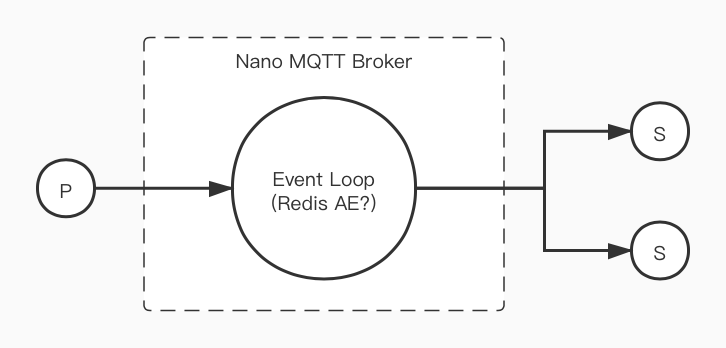

# nanomq

Nano MQTT Broker - A Ultra-light and Blazing-fast MQTT 5.0 Broker for IoT Edge.

## Requirements

- MQTT v5.0/3.1.1 Specs
- Event Loop and Async IO (Redis?)
- HOCON/Nginx Config Syntax？
- Memory usage (< 50K)
- 1 Thread/1 CPU Core
- Integrate with EdgeX Foundry
- Integrate with KubeEdge

## Architecture

# Author

EMQ X Team.
